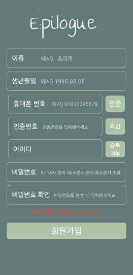
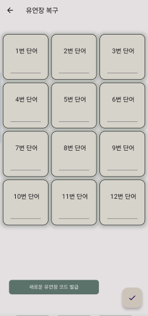
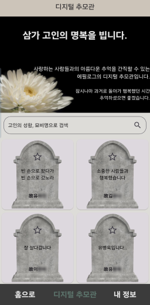
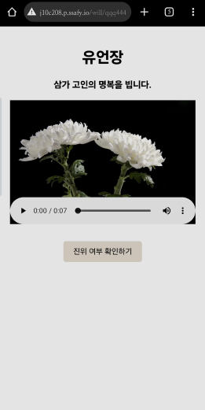

 

# E:pilogue 
## 블록체인을 이용한 디지털 유언장 생성 및 전달 서비스

 

**삼성** **청년** **SW** **아카데미** *-* **특화** **프로젝트 :**  **블록체인**

_2024.02.19 ~ 2024.04.05_

## 프로젝트 소개

**E:pilogue는** 블록체인 기술을 활용하여 디지털 유언장을 생성하고 전달하는 서비스입니다. 고령사회의 도래와 함께 유언을 통한 상속의 필요성이 증가하고 있지만, 복잡한 절차로 인해 많은 사람들이 유언 작성을 꺼리고 있습니다. 이에 따라 간편하고 안전한 유언장 작성 및 전달 서비스를 제공하여 이러한 문제를 해결하고자 합니다.

## 담당
**FrontEnd 리더**, **블록체인**

 

개인 사용 기술

- Flutter
- Solidity
- IPFS
- Provider
- Web3
  

## 기여한 부분
Frontend
- 추모관 무한스크롤 구현
- 추모관 비디오 재생 구현 
- 블록체인 연결 및 API 연결 
- IPFS <-> 웹 / 앱 오디오 재생 연결

블록체인

- 블록체인 저장을 위한 스마트 컨트랙트 작성 및 배포
- 음성파일 저장을 위한 IPFS 구축

## 주요 기능
디지털 유언 생성

- 증인 정보 입력 (최대 5명), 핸드폰 본인 인증 필수
- 유언 녹음 및 기록, 블록체인과 IPFS에 기록
- 유언 열람인 지정 (최대 5명)
- 디지털 추모관 이용 여부 선택, 추가 정보 등록 (연명치료 여부, 장기기증 여부, 장례 방식 등)

나의 유언 조회

- 마이페이지에서 나의 유언 조회 및 블록체인을 활용한 진위 여부 확인

디지털 추모관

- 추모관 리스트 조회, 고인명 또는 묘비명으로 검색
- 추모관 즐겨찾기, 사진/동영상/편지 목록 조회 및 업로드

유언 열람 신청

- 문자 및 이메일로 전달된 링크를 통해 증인이 유언 열람 신청
- 고인의 사망진단서 업로드 후 신청 검토 안내

유언 열람
 
- 앱 또는 웹으로 열람 가능, 블록체인을 통한 유언의 진위 여부 확인

## 프로젝트 성과
- 디지털 유언장: 블록체인을 이용해 안전하고 신뢰성 있는 유언장 작성 및 보관 시스템 구축.
- 디지털 추모관: 고인의 기억을 사진, 동영상, 편지 등으로 보존하고 공유할 수 있는 추모관 기능 구현. 사용자 경험 향상을 위한 무한 스크롤 구현
- IPFS 통합: IPFS와 블록체인을 결합하여 분산 저장 및 위변조 방지 기능 강화.
- 사용자 편의성: 직관적이고 사용하기 쉬운 UI/UX 디자인을 통해 사용자 접근성 향상.

## 프로젝트 화면

||||  |
|:---:|:---:|:---:|:---:|
|회원가입 화면|유언장 복구를 위한 니모닉 입력 화면|디지털 추모관 화면|유언 확인 웹 사이트|

### 느낀점 & 교훈

- 협업의 중요성: 다양한 기술과 도구를 활용하여 팀원들과 효과적으로 협업하는 방법을 배웠습니다. GitLab, Jira, Notion, Mattermost 등 협업 도구들을 적극 활용하여 프로젝트 관리와 소통을 원활하게 했습니다.
- 블록체인 이해: 블록체인의 원리와 이를 실제 서비스에 적용하는 과정을 통해 블록체인 기술에 대한 깊은 이해를 쌓았습니다.
- 문제 해결 능력: 프로젝트 진행 중 발생한 다양한 문제들을 해결하며 문제 해결 능력을 향상시켰습니다.

- 처음 접하는 기술에 대한 문제:

  - Flutter부터 블록체인까지 처음 접하는 기술이 많은 프로젝트였습니다. 이런 환경에도 불구하고 공식문서와 다른 개발자들이 문제를 해결한 방식을 찾아보며 프로젝트에 적용, 성공적으로 마무리 할 수 있었습니다. 특히, Flutter의 상태 관리와 UI/UX 디자인, Solidity를 이용한 스마트 컨트랙트 작성 등 새로운 기술들을 빠르게 습득하고 실전에 적용하는 데 성공했습니다.
  - 예상치 못한 에러와 버그 해결: 프로젝트 중간에 예상치 못한 에러와 버그가 발생했을 때, 이를 해결하기 위해 다양한 자료를 검색하고 팀원들과 협력하여 문제를 해결했습니다. 예를 들어 블록체인 분야의 블록체인 네트워크와의 연결 문제나 IPFS 노드 설정 문제 프론트엔드의 무한 스크롤, 음성파일 재생, 토큰과 해시값의 관리 등을 해결하며 기술적 역량을 키울 수 있었습니다.