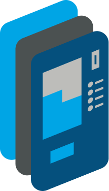

[한국어](./README.md) | [Español](./README.es.md)

|                                                    |
| :---------------------------------------------------------------------------------------: |
|                               **Nombre** : Yoo Byeong Wook                                |
|            **Blog** : [https://yoobywk.github.io/](https://yoobywk.github.io/)            |
|                             **Correo** : `tls19190@naver.com`                             |
| **03.2017 ~ 08.2023** : Graduado en la Universidad Dankook con especialización en Español |
| **07.2023 ~ 06.2024** : 10ª generación de la Academida de SW para los Jóvenes de Samsung  |

### Un desarrollador creativo que supera las barreras del idioma.

Me esfuerzo por comprender diversas culturas y formas de pensar para ofrecer experiencias intuitivas y enriquecedoras a los usarios.

### Valoro la importancia del aprendizaje y la comunicación

Creo firmemente en el poder del conocimiento compartido y en la sinergia que genera. Mantengo un blog donde discuto una variedad de temas y publico con regularidad.

### Habilidades tecnológias

### Lenguaje de Programción

🟦🟦🟦🟦⬜

- Manejo la sintaxis de JavaScript ES6.
- Capaz de desarrollar aplicaciones web utilizando una amplia gama de bibliotecas y frameworks.
- Expericia en desarrollo web con React y Vue.js

🟦🟦🟦⬜⬜

- Manejo la legibilidad y estabilidad del código a través del tipado estático.
- Experiencia en el desarrollo de proyectos con React y TypeScript

🟦🟦🟦⬜⬜

He utilizado librerías como Pandas y Matplotlib para realizar análisis y visualización de datos.

### Frameworks Web

🟦🟦🟦🟦⬜

- Puedo gestionar estados globales con `Recoil`, `zustand`
- Tengo experiencia en el desarrollo con componentes funcionales y React hooks.
- He desarrollado aplicaciones SPA(Single Page Application) utilizando React Router

🟦🟦🟦⬜⬜

- He trabajado en proyectos pequeños utilizando Vue.js.
- Tengo experiencia gestionando estados con Pinia.

🟦🟦🟦⬜⬜

- Puedo diseñar y desarrollar API RESTful utilizando Django.
- Tengo experiencia desarrollando API con Django REST Framework.

### Blockchain

🟦🟦🟦🟦⬜

- He implementado contratos inteligentes utilizando estructuras y modificadores en Solidity. - [Detallas del aprendizaje](https://yoobywk.github.io/blockchain/smart%20contract/2024/03/05/smartCont1.html)
- Tengo experiencia desplegando y probando contratos inteligentes con Remix.

### Desarrollo Móvil

🟦🟦🟦🟦⬜

- Puedo desarrollar aplicaciones multiplataforma con Flutter.
- Tengo experiencia desarrollando la interfaz de usuario y lógica de negocio con Flutter SDK y Dart.

### Tools

 🟦🟦🟦🟦⬜

- He utilizado Mattermost para la comunicación y gestión de tareas en equipo.
- Tengo experiencia colaborando eficientemente utilizando funciones como canales, hilos y notificaciones en Mattermost.

🟦🟦🟦🟦⬜

- He gestionado proyectos y seguimiento de problemas utilizando Jira.
- Tengo experiencia planificando `sprints`, asignando tareas y gestionando cronogramas con Jira.

🟦🟦🟦⬜⬜

- He diseñado y creado prototipos para aplicaciones web y móviles utilizando Figma.
- Tengo experiencia en la reutilización de componentes y la construcción de sistemas de diseño para un trabajo de diseño eficiente.

## Proyectos

<!-- |  |  |  |
| :---------------------------------------------------------------: | :-----------------------------------------------------------------------: | :---------------------------------------------------------------------: |
|                  <a href="/Mela.md">🎶 Mela!</a>                  |                   <a href="/Epilogue.md">E:pilogue</a>                    |                    <a href="/BizCard.md">BizCard</a>                    |
|              Plataforma de colaboración para músicos              |           Servicio de testamento digital utilizando blockchain            |       Servicio de gestión de tarjetas de presentación en MS Teams       |
|                      08.01.2024 ~ 16.02.2024                      |                          19.02.2024 ~ 05.04.2024                          |                         08.04.2024 ~ 17.05.2024                         | -->

---
|  |  |  |
| :---------------------------------------------------------------------: | :-----------------------------------------------------------------------: | :---------------------------------------------------------------: |
|                    <a href="/esp/BizCard.md">BizCard</a>                    |                   <a href="/esp/Epilogue.md">E:pilogue</a>                  |                  <a href="/esp/Mela.md">🎶 Mela!</a>                  |
|       Servicio de gestión de tarjetas de presentación en MS Teams       |           Servicio de testamento digital utilizando blockchain            |              Plataforma de colaboración para músicos              |
|                         08.04.2024 ~ 17.05.2024                         |                          19.02.2024 ~ 05.04.2024                          |                      08.01.2024 ~ 16.02.2024                      |