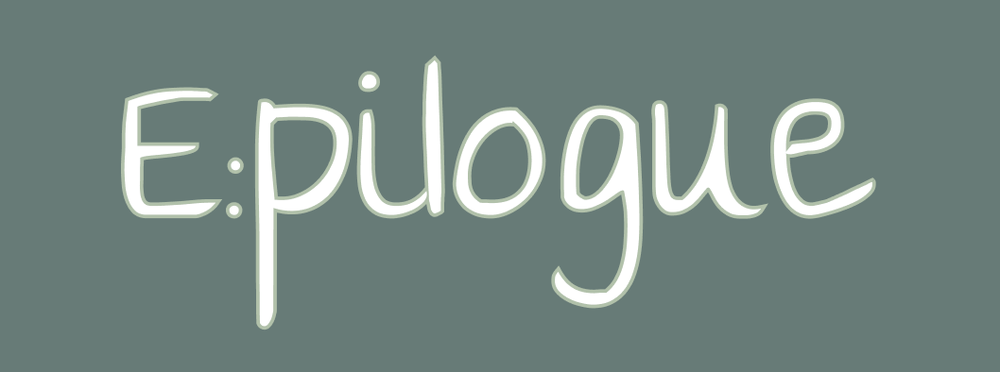
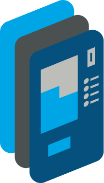
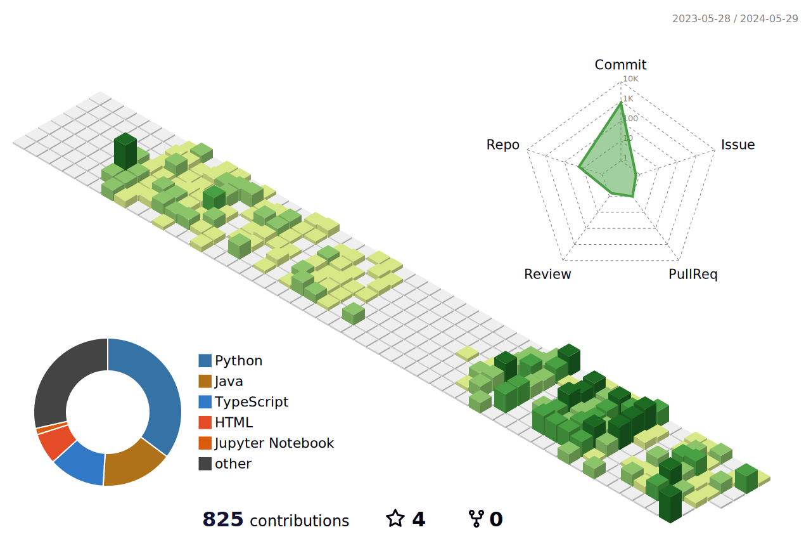

<!-- [한국어](./README.md) | [Español](./README.es.md) -->

|                              |
| :-----------------------------------------------------------------: |
|                          **이름** : 유병욱                          |
| **Blog** : [https://yoobywk.github.io/](https://yoobywk.github.io/) |
|                  **E-mail** : `tls19190@naver.com`                  |
|         **2017.03 ~ 2023.08** : 단국대학교 스페인어과 졸업          |
|         **2023.07 ~ 2024.06** : 삼성 청년 SW 아카데미 10기          |

### 언어의 경계를 넘나드는 독창적인 개발자를 꿈꿉니다

<!-- 다양한 문화와 사고방식을 이해하며 이를 바탕으로 사용자에게 직관적이고 풍부한 경험을 제공하고자 합니다.
(쓸지말지 고민) -->

### 배움과 소통의 가치를 중요하게 여깁니다.

지식은 배우고 나누면서 시너지를 낳는다는 말의 힘을 믿으며 실천하고 있습니다.  
학습한 다양한 주제를 다루는 블로그를 운영하며 지속적으로 포스팅하고 있습니다.

## 기술 스택

### 프로그래밍 언어

🟦🟦🟦🟦⬜

- ES6 자바스크립트 문법을 사용합니다.
- 다양한 라이브러리와 프레임워크를 활용하여 웹 개발을 수행할 수 있습니다.
- React 및 Vue.js를 활용하여 웹 개발을 수행한 경험이 있습니다.

🟦🟦🟦⬜⬜

- 정적 타입 지정을 통해 코드의 가독성과 안정성을 높일 수 있습니다.
- React에서 TypeScript를 사용하여 프로젝트를 진행한 경험이 있습니다.

🟦🟦⬜⬜⬜

- Pandas, Matplotlib 등의 라이브러리를 활용하여 기초적인 기능 구현을 할 수 있습니다.

### 웹 프레임워크

🟦🟦🟦🟦⬜

- `Recoil`, `zustand` 를 사용하여 전역 상태관리를 할 수 있습니다.
- 함수형 컴포넌트와 React hooks를 활용하여 개발한 경험이 있습니다.
- React Router를 사용하여 SPA(Single Page Application)를 개발하는 경험이 있습니다.

🟦🟦🟦⬜⬜

- Vue.js 를 활용하여 소규모의 프로젝트를 진행한 경험이 있습니다.
- Pinia를 활용하여 상태 관리를 수행한 경험이 있습니다.

🟦🟦⬜⬜⬜

- Django REST Framework를 활용하여 API 개발한 경험이 있습니다.

### 블록체인

🟦🟦🟦🟦⬜

- 구조체, modifier 등의 Solidity 문법을 활용하여 스마트 컨트랙트를 구현한 경험이 있습니다. -[학습내용](https://yoobywk.github.io/blockchain/smart%20contract/2024/03/05/smartCont1.html)
- Remix를 사용하여 스마트 컨트랙트를 배포하고 테스트한 경험이 있습니다.

### 모바일 개발

🟦🟦🟦🟦⬜

- Flutter를 사용하여 크로스 플랫폼 애플리케이션을 개발할 수 있습니다.
- Flutter SDK와 Dart 언어를 활용하여 UI 및 비즈니스 로직을 개발한 경험이 있습니다.

### 도구

 🟦🟦🟦🟦⬜

- Mattermost를 사용하여 팀 내 소통 및 업무 관리를 수행한 경험이 있습니다.
- 채널, 쓰레드, 알림 등의 Mattermost 기능을 활용하여 효율적인 협업을 진행한 경험이 있습니다.

🟦🟦🟦🟦⬜

- Jira를 사용하여 프로젝트 관리 및 이슈 추적을 수행한 경험이 있습니다.
- 스프린트 계획, 이슈 할당, 일정 관리 등의 Jira 기능을 활용하여 프로젝트를 관리한 경험이 있습니다.

🟦🟦🟦⬜⬜

- Figma를 사용하여 웹 및 모바일 애플리케이션의 디자인 및 프로토타입을 제작한 경험이 있습니다.
- 컴포넌트 재사용, 디자인 시스템 구축 등의 작업을 통해 효율적인 디자인 작업을 수행한 경험이 있습니다.

## 프로젝트

<!-- |  |  |  |
| :---------------------------------------------------------------: | :-----------------------------------------------------------------------: | :---------------------------------------------------------------------: |
|                  <a href="/Mela.md">🎶 Mela!</a>                  |                   <a href="/Epilogue.md">E:pilogue</a>                    |                    <a href="/BizCard.md">BizCard</a>                    |
|                  음악인을 위한 공동 작업 플랫폼                   |                   블록체인을 활용한 디지털 유언 서비스                    |                      MS Teams 內 명함 관리 서비스                       |
|                      2024.01.08 ~ 2024.02.16                      |                          2024.02.19 ~ 2024.04.05                          |                         2024.04.08 ~ 2024.05.17                         |
 -->

|  |  |  |
| :-------------------------------------------------------------------------: | :---------------------------------------------------------------------------: | :---------------------------------------------------------------: |
|                      <a href="/kor/BizCard.md">BizCard</a>                      |                     <a href="/kor/Epilogue.md">E:pilogue</a>                      |                  <a href="/kor/Mela.md">🎶 Mela!</a>                  |
|                        MS Teams 內 명함 관리 서비스                         |                     블록체인을 활용한 디지털 유언 서비스                      |                  음악인을 위한 공동 작업 플랫폼                   |
|                           2024.04.08 ~ 2024.05.17                           |                            2024.02.19 ~ 2024.04.05                            |                      2024.01.08 ~ 2024.02.16                      |
|                                 프론트엔드                                  |                             프론트엔드 & 블록체인                             |                            프론트엔드                             |

---

