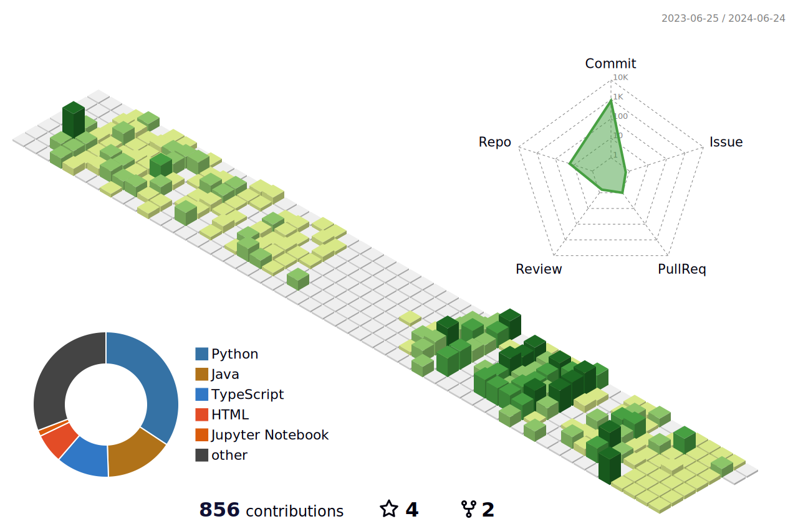

[한국어](./README.md) | [Español](./README.es.md)

## Profile

  
- #### 이름 : 유병욱
- #### Blog : https://yoobywk.github.io/
- #### E-mail : `tls19190@naver.com`
- #### 2017.03 ~ 2023.08 : 단국대학교 스페인어과 졸업
- #### 2023.07 ~ 2024.06 : 삼성 청년 SW 아카데미 10기 

### 언어의 경계를 넘나드는 독창적인 개발자를 꿈꿉니다

## 기술 스택

## 기술 스택

### 프로그래밍 언어

 

 

### 웹 프레임워크

 

### 블록체인

 

### 스타일링

### 상태 관리

### 모바일 개발

### Tools

  

