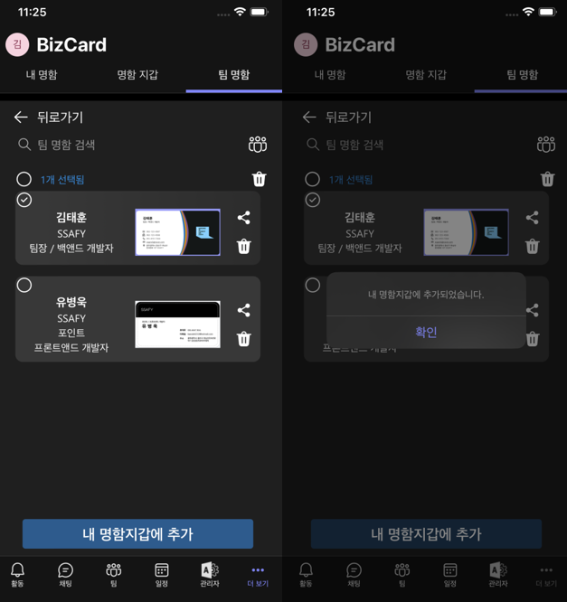
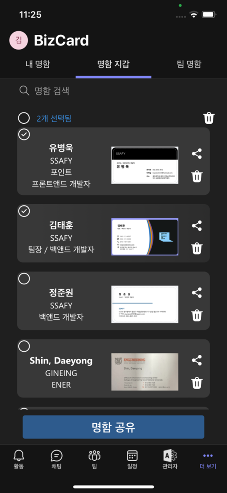
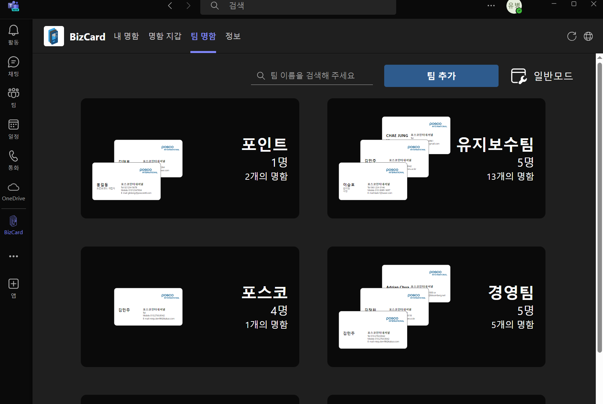
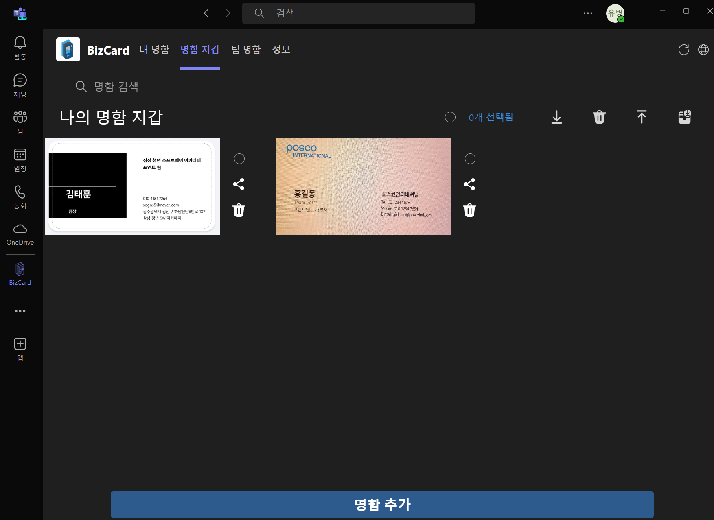
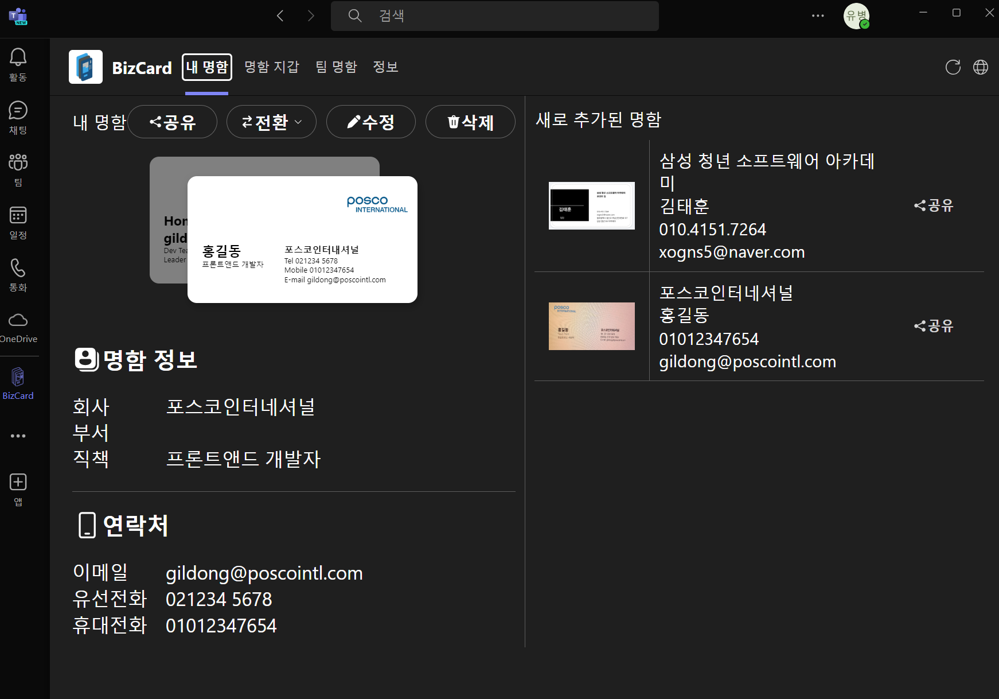

 

# BizCard

## MS Teams 명함관리 앱

**삼성** **청년** **SW** **아카데미** _-_ **자율** **프로젝트** **:** **기업연계-포스코인터내셔널**

  
  
  

_2024.04.08 ~ 2024.05.17_

_2024.05.10 포스코인터내셔널 완료 보고회_

_2024.05.20 삼성 청년 SW 아카데미 최종 발표_

## 프로젝트 소개

BizCard는 MS Teams 내부에 설치하여 사용자가 디지털 명함을 관리하고 공유할 수 있도록 돕는 앱입니다. 이 앱은 명함의 디지털화와 OCR 기술을 통해 간편하게 명함을 등록하고, 다양한 공유 방식을 지원하여 팀원 간 명함 공유를 원활하게 합니다.

## 담당

**FrontEnd**

## 기여한 부분

- 디지털 명함 퍼블리싱
- 모바일 팀 명함지갑, 개인 명함지갑 UI 구현
- API 연결 

## Link

## 프로젝트 성과
- MS Teams 內 명함 관리 및 공유 기능 구현
- 사용자 편의성을 높인 UI/UX 설계
- 이메일, 링크, 엑셀을 통한 내보내기 등 외부 공유 기능 구현
## 프로젝트 문제 및 해결

- 명함 공유의 불편함:

문제: MS Teams 외부에서 업무 흐름이 끊어진 채 명함을 공유하는 것이 번거로웠습니다.
해결: 명함을 MS Teams 내부에서 이메일, 링크, 팀 기능을 통해 손쉽게 공유할 수 있도록 기능을 구현하고, 반응형 디자인을 적용하여 PC와 모바일에서 모두 사용 가능하도록 했습니다.

## 프로젝트 화면

|  |  |
| -------------------------------------------------- | --------------------------------------------------- |

 

|  |  |  |
|:---:|:---:|:---:|
| PC 환경에서의 **팀 명함** | PC 환경에서의 명함 지갑 | PC 환경에서의 내 명함 |

