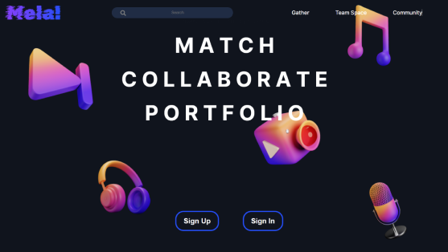
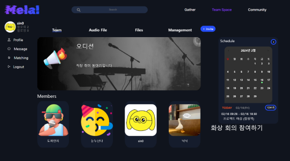
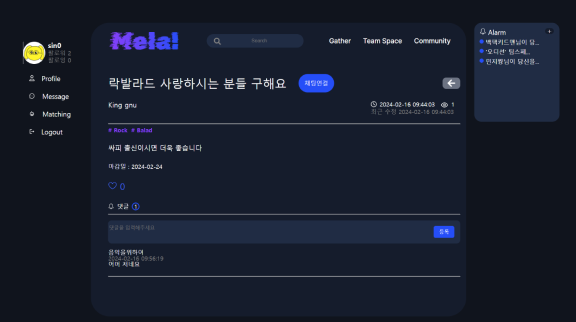

 

# Mela! 
## 음악 작업을 위한 구인, 공동 작업 플랫폼

 

**삼성** **청년** **SW** **아카데미** *-* **공통** **프로젝트** **:** **웹** **기술** 

_2024.01.08 ~ 2024.02.16_

## 프로젝트 소개

Mela!는 음악을 이제 막 시작한 아마추어, 신인 뮤지션들을 위한 플랫폼으로 이 플랫폼을 통해 사용자들은 자신의 포지션과 취향에 맞는 멤버를 찾고, 팀 스페이스를 통해 소통과 공동 작업을 진행할 수 있는 서비스 입니다. 

기획 배경: 음악 커뮤니티의 구인 위주 / 포트폴리오 위주의 한계를 넘기 위해 통합 관리 플랫폼을 개발했습니다.

## 담당
**FrontEnd**

 

개인 사용 기술

- WebRTC
- React.js
- zustand
- styled
- midi.js

## 기여한 부분

- React를 활용한 기초적 레이아웃 구성
- MIDI 파일을 활용한 음악 재생 및 시각화
- Openvidu를 활용한 화상 비디오 회의 구현
- zustand를 사용한 전역 상태 관리
- 랜딩 페이지 구현

## 주요 기능

- 멤버 구인: 사용자의 선호 장르와 포지션을 기반으로 구인 공고 추천 및 1대1 채팅 기능 제공
- 팀 스페이스: 그룹 일정 관리, 실시간 화상 채팅, 파일 업로드/다운로드 기능, 간단한 피아노 기능 제공
- 포트폴리오/숏폼 업로드 및 조회: 포트폴리오 업로드 및 다른 사용자와의 채팅 기능 제공

## 프로젝트 성과
- 실시간 협업 도구 구현 : 화상 회의 구현
  - Openvidu를 활용하여 6명까지 접속이 가능한 화상 회의를 구현
- React.js 를 활용한 게시판 구현

## 프로젝트 화면

|  |||
|:---:|:---:|:---:|
|랜딩 페이지| 팀 공간| 게시물| 

<!-- ### 느낀점 & 교훈

**첫 UI 구현 시도와 교훈**

**문제점**

- d3를 활용한 미디 파일의 시각화의 어려움
  - 기능 구현에 집중한 결과, 일정 수준의 시각화와 재생 기능을 구현할 수 있었으나 UI에서 미흡한 부분이 많이 발생했습니다.
  
- 지나친 외국어의 사용
  - midi와 관련되지 않은 다른 페이지에서 UI를 고려한 나머지, UX 면에서 영어 사용이 잦다는 불편함이 발견되었습니다. 사용자 경험을 고려하지 않은 채 디자인에만 집중한 결과였습니다.
  
---

**교훈**

이 프로젝트를 통해 UI/UX 디자인의 중요성과 사용자 중심의 설계가 얼마나 중요한지 깨닫게 되었습니다. 다음과 같은 교훈을 얻었습니다:

1. 사용자 경험의 중요성:

단순히 기능 구현에만 초점을 맞추는 것이 아니라, 사용자가 쉽게 이해하고 사용할 수 있는 인터페이스를 설계하는 것이 중요하다는 것을 배웠습니다.

2. 익숙한 언어 사용:

사용자 친화적인 언어 사용의 중요성을 깨달았습니다. 영어를 남용하는 대신, 사용자에게 익숙하고 편안한 언어로 인터페이스를 구성하는 것이 필요하다는 사실을 배울 수 있었습니다.

3. 피드백의 중요성:

사용자로부터의 피드백을 적극적으로 수용하고, 이를 통해 지속적으로 개선해 나가는 과정이 중요하다는 것을 느꼈습니다.

Mela!에서의 이러한 경험은 이후 프로젝트에서 더욱 나은 UI/UX 디자인을 구현하는 데 큰 밑거름이 되었습니다 -->